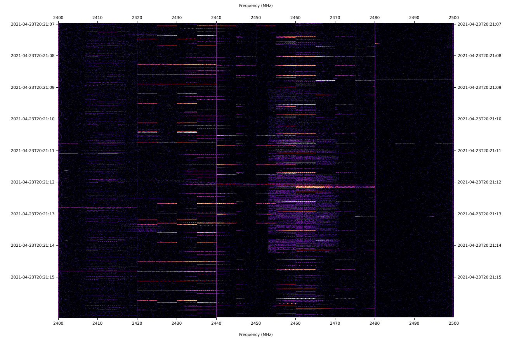

# plotsweep

`plotsweep` is a tool to plot spectrogram images from `hackrf_sweep`, `soapy_power`, or `rtl_power` output.

## Installation

1. Install Rust. The simplest option is to use [rustup](https://rustup.rs).
2. Use `cargo` to install `plotsweep`:
```
cargo install plotsweep
```

## Example usage

```
$ hackrf_sweep -f 2400:2500 -l 32 -g 32 -w 100000 > sweep.csv
$ plotsweep sweep.csv example.png --power-min -60 --power-max -15.0 --colormap magma
```

